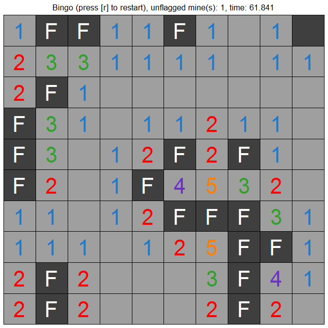
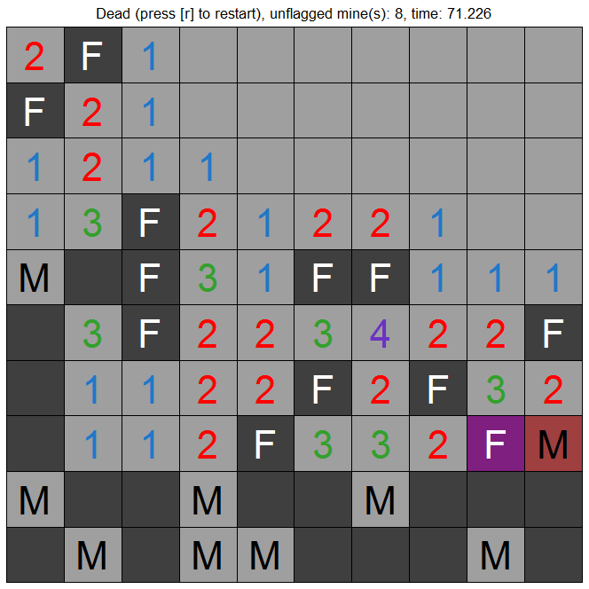

<!-- README.md is generated from README.Rmd. Please edit that file -->

# Mine Sweeper Game in R

<!-- badges: start -->

[](https://lifecycle.r-lib.org/articles/stages.html#experimental)
[](https://CRAN.R-project.org/package=mineSweepR)
[](https://github.com/zhuxr11/mineSweepR/actions)
[](https://CRAN.R-project.org/package=mineSweepR)
<!-- badges: end -->

**Package**: [*mineSweepR*](https://github.com/zhuxr11/mineSweepR)
0.0.0.9000<br /> **Author**: Xiurui Zhu<br /> **Modified**: 2023-10-06
21:25:48<br /> **Compiled**: 2023-10-06 21:25:56

**Let’s have fun with R!** This is the very popular mine sweeper game!
In this game, you are required to find out tiles that contain mines
through clues from unmasking neighboring tiles. Each tile that does not
contain a mine shows the number of mines in its adjacent tiles. If you
unmask all tiles that do not contain mines, you win the game; if you
unmask any tile that contains a mine, you lose the game. While in R, you
may also run `library(mineSweepR); help(run_game)` and check details for
game instructions.

## Installation

You can install the released version of `mineSweepR` from
[CRAN](https://cran.r-project.org/) with:

``` r
install.packages("mineSweepR")
```

Alternatively, you can install the developmental version of `mineSweepR`
from [github](https://github.com/) with:

``` r
remotes::install_github("zhuxr11/mineSweepR")
```

## Game layout

Below are two screenshots of the mine sweeper game. While game is in
progress, there are some tile types and marks:

- **<span style="color:#000000; background-color:#9F9F9F;">Light
  gray</span> tiles**: unmasked tiles.
- **<span style="color:#FFFFFF; background-color:#3F3F3F;">Dark
  gray</span> tiles**: masked tiles.
- **Count (<span style="color:#1F78C8;">1</span>/<span
  style="color:#ff0000;">2</span>/<span
  style="color:#33a02c;">3</span>/…) marks** (on unmasked tiles): number
  of mines (blank for no mines) in 8 adjacent tiles.
- **“F” marks**: <ins>f</ins>lags for possible mines on masked tiles, as
  found out and marked by player.

There may be some additional tile types and marks after losing a game:

- **<span style="color:#000000; background-color:#9F3F3F;">Red</span>
  tile**: unmasked tile containing a mine (the tile that leads to loss).
- **<span
  style="color:#FFFFFF; background-color:#7F1F7F;">Magenta</span>
  tiles**: wrongly flagged tiles (e.g. flagged tiles that do not contain
  mines).
- **“M” marks**: <ins>m</ins>ines in unflagged tiles (automatically
  unmasked after loss).

The title tells game state, the number of unflagged mines and playing
time.

- **Game state**: there are 3 possible game states:
  - Alive: game in progress
  - Bingo: after winning the game (left)
  - Dead: after losing the game (right)
- **The number of unflagged mines**: computed through literally
  subtracting the number of flags from the total number of mines, it can
  be negative and does not tell whether the flags are correct or not.
- **Playing time**: game timing starts when any tile is unmasked.



## Game instructions

<dl>
<dt>Goal</dt>
<dd>
<p>All tiles start masked. If you unmask all tiles without mines, you win the game; if you unmask any tiles containing mines, you lose the game.</p> </dd> <dt>Unmask tiles</dt>
<dd>
<p>You may click with <ins>left mouse button</ins> on any masked tile to unmask. The first tile unmasked cannot contain a mine. Timing starts when any tile is unmasked.</p> </dd> <dt>Find out mines</dt>
<dd>
<p>Each unmasked tile tells you the number of mines in adjacent tiles, unless itself contains a mine. You may use these numbers to find out the adjacent tiles with mines.</p> </dd> <dt>Flag mines</dt>
<dd>
<p>You may click with <ins>right mouse button</ins> on an unmasked tile to flag it as a possible mine. Flagged tiles cannot be unmasked, unless you click on them with <ins>right mouse button</ins> again to remove the flags.</p> </dd> <dt>Unmask adjacent tiles</dt>
<dd>
<p>You may click with <ins>left mouse button</ins> on any unmasked tile to unmask adjacent unflagged tiles, after you have set up the number of flags that equals to the count of adjacent mines shown on this tile. If any unflagged adjacent tiles contain mines, one of them is triggered and you lose the game.</p> </dd> <dt>Game statistics</dt>
<dd>
<p>After you win or lose a game, game statistics are recorded.</p> </dd> <dt>Restart game</dt>
<dd>
<p>You may restart game with <code>r</code> at any time. If you have not won or lost the game, it is not recorded in game statistics.</p> </dd> <dt><strong>BOSS KEY!</strong></dt>
<dd>
<p>You may press any key other than <code>r</code> for <i>≥</i> 2 times to close game window.</p> </dd> </dl>

## Game customization

`run_game()` offers a handful of options to customize the game,
including:

<table summary="R argblock">
<tr valign="top">
<td><code>n_mine, n_row, n_col</code></td> <td> <p>Integers as numbers of mines/rows/columns in game panel, <code>0 &lt; n_mines &lt; n_row * n_col</code>.</p> </td>
</tr>
<tr valign="top">
<td><code>unmask_button, flag_button</code></td> <td> <p>Integers as buttons to unmask/flag tiles. Usually, 0 for left mouse button (to unmask) and 2 for right mouse button (to flag).</p> </td>
</tr>
<tr valign="top">
<td><code>digit_char, mine_char, flag_char</code></td> <td> <p>Characters to mark counts/mines/flags.</p> </td>
</tr>
<tr valign="top">
<td><code>unmask_color, mask_color, hit_color, wrong_color</code></td> <td> <p>Strings as colors for unmasked tiles / masked tiles / mine-triggering tile / wrongly flagged tiles.</p> </td>
</tr>
<tr valign="top">
<td><code>digit_color, mine_color, flag_color</code></td> <td> <p>Strings as colors for <code>digit_char</code>/ <code>mine_char</code>/<code>flag_char</code> on game panel.</p> </td>
</tr>
<tr valign="top">
<td><code>window_title</code></td> <td> <p>String as window title.</p> </td>
</tr>
<tr valign="top">
<td><code>x11_args</code></td> <td> <p>Named list of arguments passed on to <code>x11</code>, excluding <code>title</code>.</p> </td>
</tr>
<tr valign="top">
<td><code>time_prec</code></td> <td> <p>Integer as time precision (e.g. 0 for seconds or 3 for miliseconds).</p> </td>
</tr>
<tr valign="top">
<td><code>restart_key</code></td> <td> <p>Character as the key to restart game, used when you have won or lost a game.</p> </td>
</tr>
<tr valign="top">
<td><code>exit_key_press</code></td> <td> <p>Integer as the times of boss key presses (other than <code>restart_key</code>) required to close game window. This may come in handy in emergency (:D).</p> </td>
</tr>
</table>
